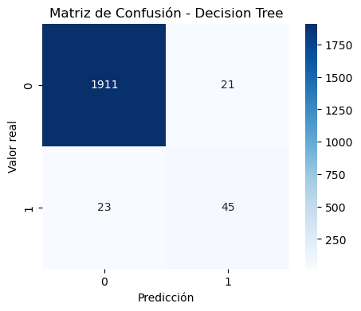
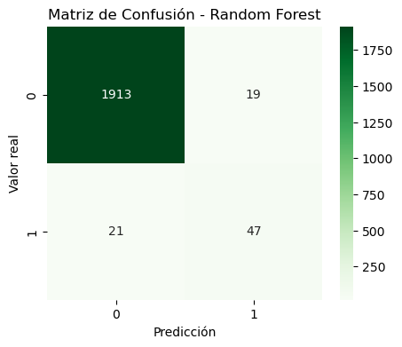
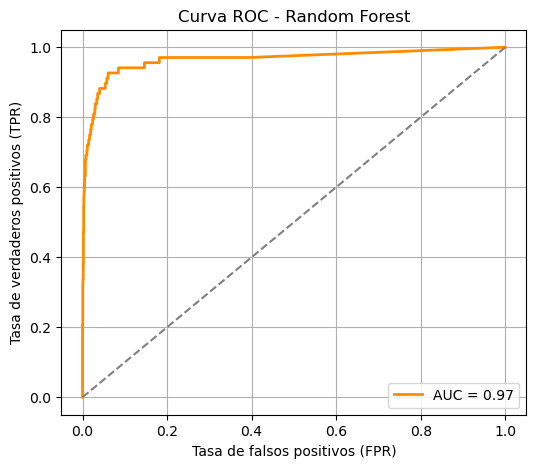
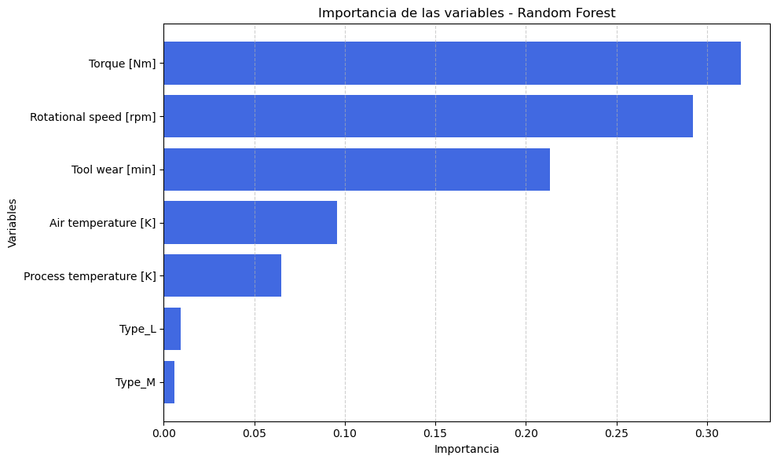

# Mantenimiento Predictivo de Máquinas

## Descripción del problema
¿Podemos predecir a tiempo si una máquina sufrirá una falla conociendo las lecturas de diferentes tipos de sensores como temperatura, velocidad de rotación, etc?

El objetivo con este proyecto es lograr predecir estas fallas a tiempo, para así realizar la debida mantención y evitar costos mayores.

## Dataset
- Fuente: [Kaggle – Machine Predictive Maintenance Dataset](https://www.kaggle.com/datasets/shivamb/machine-predictive-maintenance-classification)
- Este dataset contiene datos asociados a lecturas de sensores, los cuales dan información respecto a las condiciones operativas de máquinas en la industria. Este dataset tiene 10000 data points almacenados como filas con 14 features en columnas.
La variable objetivo es Machine failure, la cual es binaria, donde: 0 = no hay falla, 1 = hay falla.

#### 📄 Features disponibles

| Feature              | Tipo        | Descripción |
|------------------------|-------------|-------------|
| `UDI`                 | Numérica     | Identificador único del registro. |
| `Product ID`          | Categórica   | ID del producto. |
| `Type`                | Categórica   | Tipo de producto A, B o C. |
| `Air temperature [K]` | Numérica     | Temperatura del aire en Kelvin. |
| `Process temperature [K]` | Numérica | Temperatura del proceso interno. |
| `Rotational speed [rpm]` | Numérica  | Velocidad de rotación del eje de la máquina. |
| `Torque [Nm]`         | Numérica     | Fuerza de torsión aplicada. |
| `Tool wear [min]`     | Numérica     | Minutos acumulados de desgaste de herramienta. |
| `Target` (`Machine failure`) | Binaria | Variable objetivo: 0 = no hay falla, 1 = hay falla. |
| `Failure Type`        | Categórica   | Tipo específico de falla. |

Solo se utilizarán como **features** las variables numéricas relevantes (temperaturas, torque, velocidad, desgaste), junto con `Type` codificada. Se excluirán `UDI`, `Product ID` y `Failure Type`.

## Modelo seleccionado
- Random Forest

## Estrategia de evaluación
El modelo se evaluará utilizando una división de los datos en un 80% para entrenamiento y 20% para testeo, manteniendo el balance de clases. 

Las métricas utilizadas serán:
- Accuracy: para medir el desempeño general.
- Precision: para saber cuántas predicciones positivas son correctas.
- Recall: para medir cuántas fallas reales se logran detectar.
- F1-score: equilibrio entre precisión y recall.
- Matriz de confusión: para visualizar errores de clasificación.

Estas métricas permitirán evaluar el desempeño del modelo, logrando así verificar que tan bien identifica las fallas reales y si minimiza falsas alarmas, algo fundamental en un sistema de mantenimiento predictivo.

## Justificación del modelo
- Ventajas: Random Forest es un modelo robusto que maneja bien relaciones no lineales entre variables, puede trabajar con variables tanto numéricas como categóricas, y puede determinar la importancia de cada variable. Además, es menos sensible al overfitting que otros modelos como los árboles de decisión simples.
- Limitaciones: Al tratarse de un modelo de caja negra puede ser más difícil de interpretar que un árbol de decisión simple, y consume más recursos computacionales. No es muy apto para datasets extremadamente grandes o con muchos atributos irrelevantes.
- Pertinencia: El dataset contiene relaciones probablemente no lineales entre sensores y fallas, lo que hace que un modelo como Random Forest sea el más adecuado. Además, permite manejar diversos tipos de features y puede integrarse fácilmente en entornos industriales reales.

## Metodología aplicada

1. Carga y exploración inicial de los datos
   - Se revisará la estructura del dataset, los tipos de variables que presenta, y si tiene valores faltantes o inconsistentes.
2. Análisis exploratorio (EDA)
   - Se analizaran las distribuciones de las variables que son numéricas, el balance de clases en la variable objetivo y la correlación entre sensores.
3. Preprocesamiento y feature engineering
   - Se eliminarán columnas irrelevantes para la predicción, como `UDI` y `Product ID`.
   - Se codificará en binario la variable categórica `Type`.
   - Se normalizarán las variables numéricas de ser necesario.
4. Selección del modelo y entrenamiento
   - Se entrenará un modelo de Random Forest con el conjunto de entrenamiento.
   - Se realizará la división de los datos en 80/20.
5. Control de overfitting
   - Se ajustarán hiper parámetros como `max_depth`, `n_estimators` y `min_samples_split`.
   - Se usará validación cruzada (Cross-Validation) para evaluar la robustez del modelo.
6. Evaluación del modelo mediante métricas
   - Se calcularán métricas como accuracy, precision, recall, F1-score.
   - Se construirá una Matriz de Confusión y una Curva ROC.
7. Visualización de resultados
   - Se graficarán métricas y se presentará la importancia de cada variable (feature-importances) para la predicción.

## Resultados

En el proyecto se compararon tres modelos diferentes entrenados para lograr predecir fallas en máquinas.
A continuación se presentan los resultados obtenidos en cada modelo.

### 1. Decision Tree (base)
**Accuracy**: 0.98

| **Métrica**    | **Clase 0 (No falla)** | **Clase 1 (Falla)** | **Macro avg** | **Weighted avg** |
|----------------|------------------------|----------------------|----------------|------------------|
| **Precision**  | 0.99                   | 0.68                 | 0.83           | 0.98             |
| **Recall**     | 0.99                   | 0.66                 | 0.83           | 0.98             |
| **F1-score**   | 0.99                   | 0.67                 | 0.83           | 0.98             |

**Confusion matrix**:

- **Observación**: en general notamos que se presenta una muy alta exactitud, sin embargo, esto probablemente se debe a que hay una clase mayoritaria muy marcada (no falla). La capacidad que posee para detectar fallas es limitada, esto se refleja claramente en el F1 de la clase 1.

### 2. Random Forest (base)
**Accuracy**: 0.98

| **Métrica**    | **Clase 0 (No falla)** | **Clase 1 (Falla)** | **Macro avg** | **Weighted avg** |
|----------------|------------------------|----------------------|----------------|------------------|
| **Precision**  | 0.98                   | 0.88                 | 0.93           | 0.98             |
| **Recall**     | 1.00                   | 0.53                 | 0.76           | 0.98             |
| **F1-score**   | 0.99                   | 0.66                 | 0.83           | 0.98             |

**Confusion matrix**:

- **Observación**: al aplicar Random Forest  base, es decir, con n_estimators = 100 y el resto de parámetros por default, se logró una leve mejora sobre el árbol de decisión, especialmente en el F1-score de la clase minoritaria.

### 3. Random Forest (optimizado)
**Accuracy**: 0.98

| **Métrica**    | **Clase 0 (No falla)** | **Clase 1 (Falla)** | **Macro avg** | **Weighted avg** |
|----------------|------------------------|----------------------|----------------|------------------|
| **Precision**  | 0.99                   | 0.71                 | 0.85           | 0.98             |
| **Recall**     | 0.99                   | 0.69                 | 0.84           | 0.98             |
| **F1-score**   | 0.99                   | 0.70                 | 0.85           | 0.98             |

**Confusion matrix**: 

**ROC AUC**: 0.9650468883205456

**Importances**:

- **Observación**: este modelo fue, sin duda alguna, el más equilibrado y robusto. Gracias al ajuste de hiper parámetros (`n_estimators`, `max_depth`, `min_samples_split`) mediante el uso de grid-search, se logró mejorar el F1-score sin alterar demasiado la precisión global. El resultado fue un modelo más sensible a fallas reales sin overfitting.

### Sobre las gráficas
- **Matriz de confusión**: nos permitió evidenciar los tipos de errores cometidos por cada modelo.
- **Curva ROC y AUC**: nos mostraron que el modelo de Random Forest es mucho mejor para discriminar correctamente entre clases.
- **Importancia de variables**: gracias a lo observado en esta gráfica, identificamos que `Tool wear`, `Torque` y `Process temperature` son las features más relevantes a la hora de anticipar fallas en las máquinas.

### Discusión crítica

El Árbol de Decisión fue útil como modelo de referencia, pero su desempeño en la clase minoritaria fue bien limitado. En cambio, con Random Forest, se pudo notar como este trajo mejoras evidentes gracias a su gran capacidad para modelar relaciones no lineales y mitigar el desbalance al usar `class_weight='balanced'`.

El modelo final, es decir, Random Forest optimizado mediante cross-validation en grid-search, logró el mejor rendimiento general en el proyecto. Este mantuvo un alto accuracy y una capacidad decente para detectar fallas, esto se puede confirmar al observar sus métricas (F1-score = 0.70, AUC = 0.97). Además, el análisis de variable importance nos sirvió para obtener una mejor interpretabilidad sobre qué condiciones operativas son más críticas al momento de determinar si una máquina requiere mantenimiento o no. Cabe mencionar, que aunque obtuvimos las features más relevantes relacionadas a fallas, estas tuvieron valores no tan altos en importancia, donde Torque logró el mayor valor, siendo de 0.35 aproximadamente.

Estos resultados validan el uso de Random Forest como solución efectiva y confiable para mantenimiento predictivo en entornos industriales. Y de esta manera, logrando reducir costos.

## Conclusiones

- A través del presente proyecto se desarrolló un sistema de mantenimiento predictivo capaz de anticipar fallas en máquinas industriales, utilizando modelos de clasificación supervisada entrenados con lecturas de diferentes tipos de sensores, como torque, temperatura y desgaste de herramienta (tool wear), entre otros.

- El modelo base, es decir, el Árbol de Decisión, entregó buenos resultados iniciales, pero demostró bastantes limitaciones en cuanto a la detección de fallas, esto debido al desbalance de clases.

- El modelo de Random Forest optimizado con cross-validation y ajuste de hiper parámetros mostró un rendimiento significativamente superior, alcanzando un F1-score de 0.70 en la clase de fallas y un AUC de 0.97 aproximadamente. Además, el uso del parámetro `class_weight='balanced'` nos permitió compensar eficazmente el desbalance sin tener que obligarnos a eliminar datos importantes.

- Las diferentes métricas obtenidas y las gráficas asociadas (matriz de confusión, curva ROC y variable importance) nos confirmaron que el modelo tiene una alta capacidad de generalización, con un buen potencial para ser efectivo en aplicaciones industriales tras testeo previo en entornos reales.

- Finalmente, concluimos que la combinación de buenas prácticas en preprocesamiento, selección de características, cross-validation y análisis de resultados nos permitió construir un modelo robusto, preciso e interpretable para mantenimiento predictivo.

## Autores
Diego Avendaño y Braulio Silva
